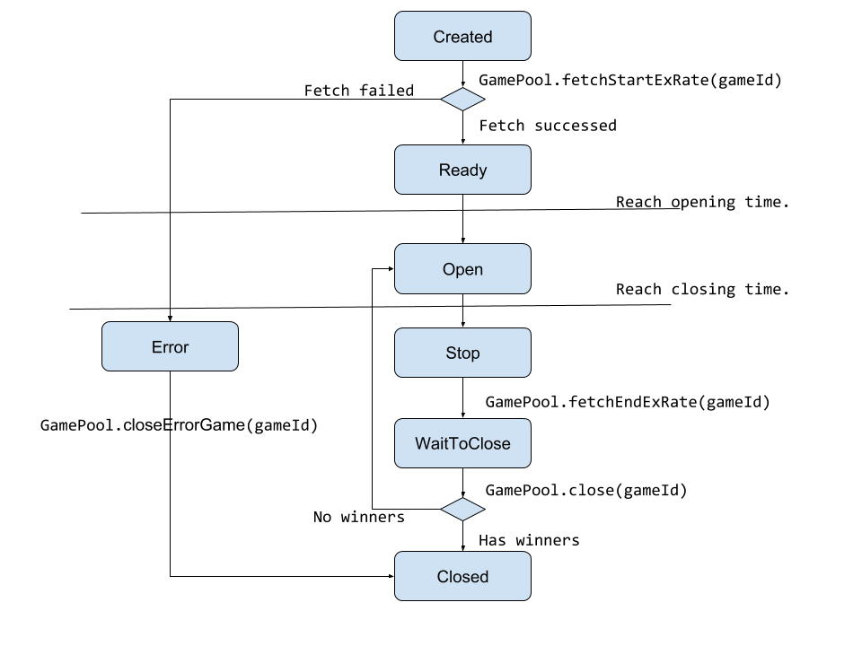

GamePool Operations
======================

Send Orcalize Fee to GamePool Contract
----------------------------------------

Two methods to send the fee.
1. Call `GamePool.sendOraclizeFee` with some ether(like 100 finney) from the creator addres.
2. Send the fee to contract address.

Withdraw the Orcalize Fee
----------------------------------------
Call `GamePool.withdrawOraclizeFee` from the creator address.

Withdraw the Uclaimed Awards
----------------------------------------
Call `GamePool.getUnclaimedAward` from the creator address.

#### Parameters ####
1. `uint256 gameId` - The id of the operated game.

Withdraw the Unclaimed Refunds
----------------------------------------
Call `GamePool.getUnclaimedRefunds` from the creator address.

#### Parameters ####
1. `uint256 gameId` - The id of the operated game.

Game Operation
----------------------------------------
The life cycle of a game is shown as the following image.

### Game State (N/A => `Created`) ###
Call `GamePool.createNewGame` with the following parameters from the creator address. The function successed if the previous game has been closed by the Mamba Team or the previous game was in `Error` state. `Created` state means that the game has been deployed to blockchain, but not allowed for players to take bets.

#### Parameters ####
1. `uint256 openTime` - The opening time of the game. (In unix time format).
2. `uint256 duration` - The time duration in seconds per game segment.
3. `string coinName0` - The short name of the 1st coin, like BTC, ETH...
4. `string coinName1` - The short name of the 2nd coin, like BTC, ETH...
5. `string coinName2` - The short name of the 3rd coin, like BTC, ETH...
6. `string coinName3` - The short name of the 4th coin, like BTC, ETH...
7. `string coinName4` - The short name of the 5th coin, like BTC, ETH...
8. `uint8[50] YDistribution` - The 50 possible final values of `Y`. `Y` will be choosed when the game was closed. This array of values change the final `Y` value from uniform random distribution to any possible discrete distribution. `Y` belongs [0, 100].
9. `uint8 A` - Percentage of awards distributed to `Y%` players who bets in advance. `(A + B)` belongs [0, 100].
10. `uint8 B` - Percentage of awards distributed to players who are not in `Y%`. `(A + B)` belongs [0, 100].
11. `uint16 txFee` - One of thousand percentage of bet amount will be tx fee. `txFee` belongs [0, 1000].
12. `uint256 minimumDifferenceBetsForWinner` - Minimum difference amount in ether for a winner coin to winner other coins.

### Game State (`Created` => `Ready` or `Created` => `Open`) ###
Call `GamePool.fetchStartExRate` with the following parameters from the creator address. This function will query the start exchange rate of the coins with orcalize service. When the exchange rates of all 5 coins are written to blockchain, the game state will change to `Open` if the opening time is reached or `Ready` if the opening time is not reached. 

`Ready` state means that the game is ready to player but waiting for the opening time is reached.

#### Parameters ####
1. `uint256 gameId` - The id of the operated game.

### Game State (`Ready` => `Open`) ###
The game state will change to `Open` when the opening time is reached and without any interactions. Players are able to take bets only in `Open` state.

### Game State (`Open` => `Stop`) ###
The game state will change to `Stop` when the closing time is reached and without any interactions. `Stop` state means that the game is closed for any bets but cannot decide winners because the end exchange rates have not been written to blockchain.

### Game State (`Stop` => `WaitToClose`) ###
Call `GamePool.fetchEndExRate` with the following parameters from the creator address. This function will query the end exchange rate of the coins and the randomly choosed Y with orcalize service. When the exchange rates of all 5 coins and Y are written to blockchain, the game state will change to `WaitToClose`. 

`WaitToClose` state means that the game has all information to decide winners and the awards, but waiting for a external trigger.

#### Parameters ####
1. `uint256 gameId` - The id of the operated game.

### Game State (`WaitToClose` => `Closed` or `WaitToClose` => `Open`) ###
Call `GamePool.close` with the following parameters from the creator address. This function will decide winners and awards. If the winners have been choosed by the game rule, the game goes to `Closed` and players can get awards. If not, the game goes to `Open` and extend the game duration by the `duration` parameter written on game creation.  

`Closed` state means that the game is closed and player can get their awards. 

#### Parameters ####
1. `uint256 gameId` - The id of the operated game.

### Game State (`Created` => `Error` or `Stop` => `Error`) ###
`Error` state means that the game doesn't have enough information to determine the winners at the closing time. Situations like the response time was too long for updating exchange rates. 

Players Get Awards
--------------------------
Call `GamePool.getAwards`. Players can get awards within 30 days after the closing time of the game.

#### Parameters ####
1. `uint256 gameId` - The id of the game.

Players Get Refunds
--------------------------
Call `GamePool.claimRefunds`. Players can claim refunds only when game was in `Error` state and within 30 days after the closing time of the game.

#### Parameters ####
1. `uint256 gameId` - The id of the game.
